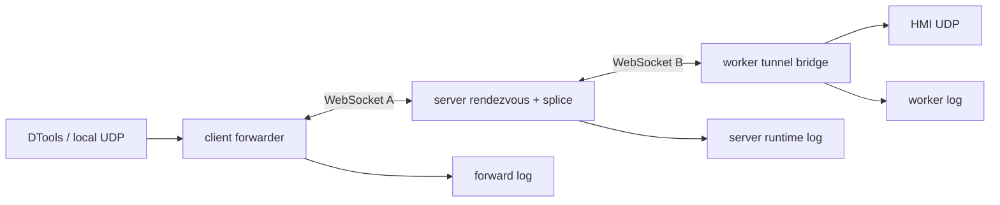

<!-- template_id: design; template_version: 1.1.1 -->
# gofer tunnel 文件日志与 UDP 延迟优化设计

> 状态：Approved 0.3 / 实施中

## 修订记录

| 版本 | 日期 | 作者 | 摘要 |
|---|---|---|---|
| 0.1 | 2026-09-15 | Codex | 初稿：统一 server、worker、forwarder 日志关联，并定义 UDP 延迟优化边界 |
| 0.2 | 2026-09-15 | Codex | 扩大日志范围：覆盖 server/worker 关键运行生命周期，tunnel 作为重点场景 |
| 0.3 | 2026-09-15 | Codex | 落实人工评审：主日志独占与 daemon 旁路、显式/隐式失败、轮转默认值、进程 run id、trace 开关及双 sink 格式 |

> 仅语义变化递增版本；纯 identity/provenance/元数据纠正沿用原版本，并在 Git/进度记录中留痕。

## 背景与目标

`gofer tunnel forward` 当前把连接事件打印到启动它的终端，server 和 worker 的 `slog` 默认写 stderr。一次 HMI 下载跨越本机 UDP、client WebSocket、server 中继、worker WebSocket 和 worker UDP，失败或变慢时无法从统一文件重建完整链路。

本设计要达到三个结果：

1. 每条 tunnel 使用同一个 `tunnel_id` 在 server、worker 和本机 forwarder 之间关联，持久记录建立、首包、累计字节、关闭原因、时延和错误，不记录协议 payload、token 或 Authorization。
2. 降低 UDP 转发的可观测延迟和不必要开销，但保持当前安全边界和 server 中继拓扑；只有证据证明中继本身是瓶颈时，才评估直连或专用 data plane。
3. 为 server 和 worker 的关键运行路径建立稳定日志：启动与停止、配置加载、worker 注册/断线/重连、策略推送/应用、任务接收/派发/完成、队列/并发限制、外部连接错误和恢复动作；日志必须能解释程序当前为什么运行、等待、拒绝或退出。

公开规划声明：`thinking_mode=RIGOROUS`；核心目标是可观察的 server/worker 运行状态、可追踪的 tunnel 诊断和可度量的 UDP 延迟；scope freeze 为 `tools/gofer` 内 logx、server/worker 关键生命周期、tunnel 协议观测和 UDP 数据路径；不扩展到部署、硬件下载协议重实现或 worker/client 直连；`expansion_policy=DEFER_OR_REQUEST`；review budget 为 discovery + confirmation 后停止，除非出现 CORE_BLOCKING；停止条件是事实链、日志字段、优化候选和回滚边界均可验证。

## 名词

- **client forwarder**：运行 `gofer tunnel forward` 的本机进程，监听本地 TCP/UDP 端口。
- **server relay**：gofer server 的 `/v1/tunnels/connect` 与 `/v1/tunnels/worker-connect`，在两个 WebSocket 之间执行 `tunnel.Splice`。
- **worker data socket**：worker 在目标网络上创建的 TCP 连接或 UDP `net.ListenPacket(":0")` socket。
- **UDP session**：一个本机 UDP 来源地址对应的一条 client WebSocket tunnel；默认按来源地址隔离并按 idle timeout 回收。

## 范围与非目标

范围包括 `internal/logx`、server 启停与配置/HTTP 服务、worker 注册/心跳/重连/策略/任务执行、server tunnel handler、worker tunnel bridge、client forwarder、tunnel list/诊断接口和相关测试；日志文件路径、轮转、字段脱敏及 UDP 时延测量也在范围内。

非目标包括 Kinco 下载协议重实现、修改 HMI 固件、绕过 server 的 client-worker 直连、改变 worker allowlist、改变默认安全认证、部署或硬件下载操作。任何直连 data plane 都作为后续独立设计，不在本计划内。

## 已确认事实与规范

- `gofer tunnel forward` 在 [internal/commands/tunnel.go](../../internal/commands/tunnel.go) 中创建 `Forwarder`，当前非 quiet 日志使用 `fmt.Printf`。
- [internal/client/client.go](../../internal/client/client.go) 的 `DialTunnel` 连接 server 的 tunnel connect endpoint。
- server 收到 client WebSocket 后通过 hub 给 worker 发送 `TunnelOpen`，再等待 worker 回连并用 `tunnel.Splice` 中继两条 WebSocket。[internal/httpapi/tunnel_handler.go](../../internal/httpapi/tunnel_handler.go)
- worker 在 [internal/worker/tunnel.go](../../internal/worker/tunnel.go) 上通过现有控制连接收到 open，再向 server 的 worker-connect endpoint 新建 data WebSocket；UDP 使用未连接 `net.ListenPacket(":0")`。
- [internal/logx/logx.go](../../internal/logx/logx.go) 当前只把 `slog` 写入 stderr；Unix daemon 把子进程 stdout/stderr 重定向到 `run/serve.log` 和 `run/worker-<id>.log`。Windows 的 `reexecDetached` 返回 `errNotSupported`，前台 server/worker 尚无持久日志。
- `gofer tunnel check` 的 UDP 成功只证明 worker socket/授权路径建立，不证明设备应用层有响应。
- 规则按 IDEV-STD 0.19.0 当前绑定执行；本设计不复制中央规则正文。

## 总体方案

### 1. 统一事件模型

扩展日志上下文，固定字段：`ts`、`level`、`component`、`event`、`operation_id`、`tunnel_id`、`session_id`、`worker_id`、`job_id`、`network`、`target`、`local`、`duration_ms`、`bytes_up`、`bytes_down`、`close_reason`、`error_code` 和 `error`。地址只记录 host/port，不记录 token、完整请求头或 UDP payload。

`operation_id` 是进程一次运行的 run id：进程启动时生成短随机串，作为 logger 基础属性附加到该进程全部日志；不是每请求 id。`component` 由调用方传 `serve`、`worker` 或 `forward`；tunnel、UDP session 和任务分别用 `tunnel_id`、`session_id`、`job_id` 关联。

事件至少包括 tunnel 的 `tunnel.requested`、`tunnel.rendezvous_started`、`tunnel.worker_connected`、`tunnel.opened`、`tunnel.first_up`、`tunnel.first_down`、`tunnel.closed`、`tunnel.rejected` 和 `tunnel.error`；server 的 `server.starting`、`server.ready`、`server.config_loaded`、`server.shutdown`、`server.http_error`；worker 的 `worker.starting`、`worker.registered`、`worker.heartbeat_missed`、`worker.reconnecting`、`worker.disconnected`、`worker.policy_received`、`worker.policy_applied`、`worker.job_started`、`worker.job_finished`、`worker.job_rejected` 和 `worker.shutdown`。

关键点日志按状态转移和失败边界记录，禁止在高频循环中逐条打印正常心跳或每个 UDP payload。心跳只在连接建立、连续失败、恢复和最终断线时记录；任务只记录生命周期和结果摘要。

### 2. 文件输出

`logx` 提供 stderr + 文件双 sink；stderr 保持现有 text handler 格式，文件为 JSON Lines，两者共用 `GOFER_LOG_LEVEL`。server/worker 无论前台或 daemon 默认开启文件 sink：server 为 `<config-dir>/run/serve.log`，worker 为 `<config-dir>/run/worker-<worker-id>.log`。纯 CLI 子命令（job/plan/config 等）默认只写 stderr。本机 forwarder 默认路径为 `<config-dir>/run/tunnels/forward-<start-time>-<pid>.log`，增加 `--log-file`/`--log-dir`；`--quiet` 只关闭终端输出，不关闭文件输出。

主 `run/serve.log`、`run/worker-<id>.log` 由 logx 文件 sink 独占，避免 text/JSONL 双写和 Windows 轮转占用。`daemon.Spawn` 将子进程原始 stdout/stderr 追加到旁路 `run/serve.out.log`、`run/worker-<id>.out.log`，只承接 panic/非 slog 输出，不轮转；daemon 子进程文件 sink 可用时不再输出 slog 到旁路。`serve -d` / `worker -d` 的提示仍指向主 `.log`；Windows daemon 保持不支持。

允许使用 `gopkg.in/natefinch/lumberjack.v2`（零传递依赖），按大小轮转，MaxAge 清理过期备份，不做定点日切；Windows 上先关闭再重命名。默认单文件 50 MB、保留 14 天、最多 10 份备份，大小、天数、份数和路径均可配置。若用 stdlib 自写，必须覆盖并发写、Windows 重命名、清理不删未过期文件测试。

显式配置（配置字段、`--log-file`/`--log-dir` 或环境变量）对应的日志文件打开/写入失败，启动失败并在 stderr 报错。隐式默认路径失败时，在 stderr 发出一条 warn 后降级为仅 stderr，不阻断 CLI。日志内容不进入 tunnel payload，也不依赖 `gofer.db` 才能排障。ReplaceAttr 对 key 包含 token、authorization、password、secret（大小写不敏感）的属性值统一替换为 `***`。

### 3. UDP 优化策略

先测量再优化，禁止把“减少日志”当作协议加速。优先做不改拓扑的优化：

- client forwarder 复用已建立的 server tunnel，避免每个 UDP 数据报重新创建 WebSocket；当前实现已按来源地址复用 session，需补齐首包、握手和每阶段耗时指标。
- WebSocket 两侧保持压缩关闭，避免小型工业 UDP 帧的压缩 CPU 与 flush 成本；保留 binary message 一报一帧语义，避免引入粘包协议。
- server relay 使用有界缓冲、避免 payload 复制和 debug 级逐包日志。逐报文 trace 默认关闭，仅显式设置 `GOFER_TUNNEL_TRACE=1` 时启用；只记录方向、长度和耗时，永远不记录 payload、token、Authorization 或完整查询串。关闭时热路径不得产生格式化开销；T07 runbook 必须写明此开关。
- worker 侧固定复用每个 UDP session 的 socket，并记录 `client->server`、`server->worker`、`worker->device` 三段时间；如实测 HMI 要求源端口，新增显式 source-port 能力，不隐式猜测。
- 为 TCP 和 UDP 分别统计 `dial_ms`、`rendezvous_ms`、`first_byte_ms`、`last_packet_gap_ms`。TCP 感觉更快可能是长连接/少轮次，不能仅凭传输协议名称判断。

只有当上述指标显示 server relay 是主要瓶颈，才另立设计评估 client-worker data plane；当前不改变 server 中继。

## 架构

server 仍是唯一中继点；worker 不直接接受本机 client 的 WebSocket。每个端点写入同一 `tunnel_id`，UDP session 另带 `session_id`。

## 关键流程

1. forwarder 分配 `tunnel_id`，记录本地监听、目标、worker 和 network。
2. client 请求 server connect；server 记录 rendezvous 开始时间。
3. server 通过控制 WebSocket 发送 `TunnelOpen`；worker 建立目标 socket，并回连 worker-connect。
4. server 验证 nonce、worker 和 instance，连接两侧 data WebSocket，记录 `worker_connected` 和 `opened`。
5. UDP 首个 binary message 到达时记录 `first_up`；worker 首个设备响应到达时记录 `first_down`。
6. 连接关闭、idle 回收、拒绝或错误时，三端写入累计字节、持续时间和关闭原因。
7. server/worker 关键运行状态通过 `operation_id`、`worker_id` 和 `job_id` 关联；`gofer tunnel ls` 继续提供活动态，历史 tunnel 诊断使用文件日志按 `tunnel_id` 关联。

## 安全、数据、运维与回滚

日志默认不记录 payload、凭据、Authorization、完整 URL 查询串或工程文件内容。日志目录应使用当前运行用户可写权限，Windows 服务账号与 CLI 用户的路径必须显式显示。轮转失败不应删除旧日志；打开/写入失败按文件输出一节区分显式错误与隐式降级，不得静默丢失日志。

回滚使用前一版本代码；删除日志配置会恢复默认文件路径。协议字段增加应保持向后兼容，旧 worker 仍可忽略未知观测字段。UDP 优化必须逐项开关，任何 RTT、down bytes 或错误率恶化都能恢复到当前 session/relay 行为。

## 决策

- 决策：继续以 server 为 tunnel data relay，日志先做三端关联，不做直连。
- 决策：先优化连接复用、缓冲和测量，再决定是否需要拓扑变化。
- 决策：日志默认结构化文件 + stderr；forwarder 不再只依赖启动终端。

## 待确认事项

- 日志大小、保留天数和份数已定为 50 MB / 14 天 / 10 份，可按机器磁盘预算配置；trace 已确定为显式 `GOFER_TUNNEL_TRACE=1` 开启，不再作为待批准项。
- Kinco HMI 是否要求固定 worker UDP 源端口；需要真实抓包或直连对照确认。

## 结论与人工计划 Gate

设计将日志缺失和 UDP 延迟拆成可观测性问题与数据路径问题：先让 server/worker 的运行生命周期以及三端 tunnel 以统一上下文记录事实，再基于真实阶段耗时优化。UDP 不适合通过逐报文日志或盲目改成直连来加速；当前最小风险优化是 session 复用、减少复制、保持压缩关闭和增加分段计时。

本设计为 `Approved 0.3`，已批准实施（2026-09-15）；批准证据为当前 job 请求及其六条评审修订。当前执行范围仅 W0+W1（T00/T01/T02）；后续任务遵循各 job 授权。未授权重启、reload、部署、push 或硬件下载。
