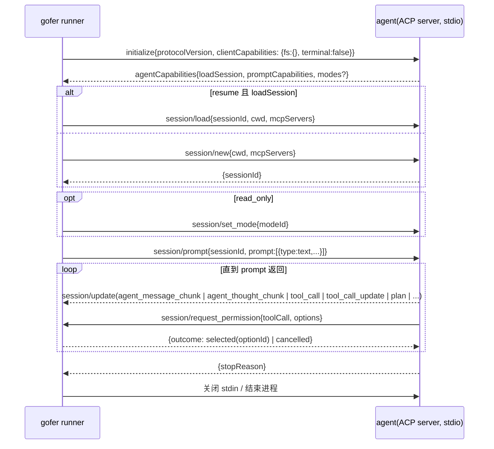

<!-- template_id: design; template_version: 1.1.1 -->
# acp-agent 类型（ACP-01）与审批门 / 人工验收（GATE-01）设计

> 状态：Approved 0.2 / 实施中（2026-09-17 人工批准；IM 双向审批暂不做）

## 修订记录

| 版本 | 日期 | 作者 | 摘要 |
|---|---|---|---|
| 0.1 | 2026-09-17 | Claude | 初稿：以 Agent Client Protocol 统一驱动 claude/codex/gemini/omp；ACP 的 permission 请求作为审批门输入；job 级 needs_review 验收态 |
| 0.2 | 2026-09-17 | Claude | 人工批准。决策：IM 侧只做通知不做双向审批（当前 bot 只能发不能收）；`read_only`（bd h-aii-0ql3）并入 S2；补协议细节（JSON-RPC 2.0、stdio 换行分隔、`protocolVersion` 整数、ToolKind 取值）与 S0 的可测试性要求（仓内假 ACP server 测试替身） |

## 背景与目标

现状每接一个 agent 都要单独处理：codex 靠输出里 `session id:` 正则捕获会话、claude 靠 `--session-id` 注入、omp 只有 `--mode json` 才打会话行；输出格式三家三样（文本 / stream-json / 逐 token json），日志膨胀与实时可读性靠采集端过滤（h-aii-rpky）补丁式解决；运行中"求批"更是各家私有（claude 有 permission prompt，codex 靠 `-a never` 关掉，omp `--approval-mode`），gofer 的 `pending_interaction` 只能承接 agent 主动经 HTTP/MCP 提的问题。

[Agent Client Protocol](https://agentclientprotocol.com)（ACP，Zed 2025-08 发布，JSON-RPC 2.0 over stdio）把这些都标准化了：`initialize` 能力协商、`session/new|load|prompt|cancel|set_mode`、`session/update` 通知（`agent_message_chunk` / `agent_thought_chunk` / `tool_call` / `tool_call_update` / `plan` / `available_commands_update` / `current_mode_update`）、agent→client 的 `session/request_permission`（选项 `allow_once|allow_always|reject_once|reject_always`）、`session/prompt` 的 `stopReason`（`end_turn|max_tokens|max_turn_requests|refusal|cancelled`）。Gemini CLI 原生（`--acp`）、omp 原生（`omp acp`）、Claude Code 经 `claude-code-acp` 适配器、Codex 经 `codex-acp` 适配器；Zed / JetBrains / OpenHands 等都是客户端。

目标：

1. 新 agent 类型 `acp-agent`：gofer 作为 ACP client 起 agent 进程、跑完一个 prompt、拿到**统一的结构化事件流**；claude/codex/gemini/omp 四家共用一套代码。
2. ACP 的 `session/request_permission` 成为 gofer **审批门**的原生输入；审批策略按项目/agent 配置，人在 web/CLI/IM 作答。
3. job 级**人工验收态** `needs_review`：agent 完成 ≠ 交付完成，agent（含 supervisor）不能 accept 自己的工作。
4. 会话续跑（resume）、取消、只读模式在 ACP 路径上有统一实现；cli-agent 路径保持不变。

## 已确认事实

- `internal/agent`：`cli-agent` 由 `command`+`args` 模板渲染，会话靠 `session_inject`/`session_capture`/`session_resume`（`builtinSessionDefaults` 只有 claude/codex，v0.42 加 omp）；`Modes()` 判批处理/交互能力。
- `internal/job`：运行中交互 `POST /v1/jobs/{id}/interactions` → `pending_interaction` → answer/punt；worker 侧经 `pumpInteractions` 镜像到 hub；MCP `gofer_get_interactions`/`gofer_answer_interaction`；IM 通知走 `server.notification.webhooks.events`。
- 日志：stdout/stderr 落结果目录文件；job 事件（`job.submitted/running/terminal/...`）入 jobstore 事件表并可 SSE；`changes.diff` 由 `captureDiff` 采集。
- 路线图 AUTO-01（审批门）被定义为自主化 epic 的安全闸；bd `h-aii-0z9e`（needs_review）、`h-aii-0ql3`（read_only）与本设计相关。

## 一、ACP-01 `acp-agent`

### 1. 定义与内置模板

```yaml
agents:
  claude-acp: { type: acp-agent, command: npx, args: [-y, "@zed-industries/claude-code-acp"], detect: { command: npx, args: [-y, "@zed-industries/claude-code-acp", --version] } }
  codex-acp:  { type: acp-agent, command: codex-acp }
  gemini-acp: { type: acp-agent, command: gemini, args: [--acp] }
  omp-acp:    { type: acp-agent, command: omp, args: [acp] }
```

- `args` 是**启动 ACP server 的 argv**，不含 `{{prompt}}`（prompt 走协议）；`acp` 子块可选：`modes: { read_only: "ask" }`（把 gofer 的只读模式映射到该 agent 的 mode id）、`permission_policy`（见 GATE-01）、`env`。
- 能力位：`Modes()` 对 acp-agent 返回 batch=true、interactive=false（pty 会话仍走 `cli-agent + interactive_args`）。
- 内置模板给出上面四家的默认值；用户 overlay 仍是整体覆盖。

### 2. 执行流程（一个 job = 一个 agent 进程 = 一个 session = 一个 prompt turn）



- **cwd** 传 job 的解析后 cwd（含 worktree 映射）；**mcpServers** 由项目/agent 配置注入（gofer 自己的 MCP server 也可以注入，让 agent 反过来派 job / 问人）。
- **clientCapabilities**：第一版**不**声明 `fs`/`terminal` 委托——agent 用自己的工具在本机读写与执行（与今天 cli-agent 一致，边界仍是项目 cwd + agent 自身沙箱）；委托实现（gofer 代执行、可审计每个文件写入）作为阶段 2。
- **取消**：job cancel → `session/cancel` 通知 → 等 `session/prompt` 以 `cancelled` 返回（有界，超时则杀进程）。
- **超时**：沿用 job timeout；到期同 cancel 路径。

### 3. 事件与日志映射（紧凑、统一）

| ACP | gofer |
|---|---|
| `agent_message_chunk` | 追加到 `stdout.log`（纯文本，合并 chunk），同时作为实时流 |
| `agent_thought_chunk` | 不入 stdout；`acp.jsonl` 记 `thought`（可配置丢弃） |
| `tool_call` / `tool_call_update` | `acp.jsonl` 一行一事件（`toolCallId, title, kind, status, locations, rawInput 摘要`）；job 事件 `job.tool_call`（status 变化才记，不记每次 content 更新）；web 时间线 |
| `plan` | `acp.jsonl`；web 侧显示为任务清单；可选同步为 plan todo（阶段 2） |
| `session/request_permission` | 交互 `kind=permission`（见 GATE-01） |
| `stopReason` | `end_turn`→done；`max_tokens`/`max_turn_requests`→done + `stop_reason` 字段 + warn；`refusal`→failed(`error_code=refusal`)；`cancelled`→cancelled/timeout |
| `sessionId` | 写入 `JobResult.SessionID`（统一 resume 入口）|
| usage（若 agent 提供，如 omp 的 `turn_end.usage`）| `acp.jsonl` + JobResult `usage` 摘要 |

结果目录：`stdout.log`（文本）、`stderr.log`（agent 进程 stderr）、`acp.jsonl`（紧凑事件，每行 ≤ 4KB，rawInput/rawOutput 截断）、`changes.diff` 照旧。h-aii-rpky 的采集端过滤只服务仍走 cli-agent 的路径。

### 4. resume / read_only / worker

- **resume**：源 job 是 acp-agent 且 agent 声明 `loadSession` → `job resume` 用 `session/load` + 新 prompt（不再需要 per-agent `session_resume` 模板）；不支持 `loadSession` 的 agent 回退到 cli-agent 的 resume 模板（若有），否则拒绝并说明。自动 resume（v0.42）同样适用。
- **read_only**（`h-aii-0ql3`）：`job run --read-only` → acp-agent 有 `modes.read_only` 映射则 `session/set_mode`，否则拒绝 "agent has no read-only mode"；cli-agent 路径按原 bd 方案映射沙箱参数；同一 job 内不允许升级。
- **worker**：acp-agent 与 cli-agent 一样在执行机上跑；`acp.jsonl` 与 stdout 一起镜像；permission 请求走现有交互镜像帧（`interaction{open}`）上送 hub，答复下发。
- **MCP 透传**：`session/new.mcpServers` 由 `agents.<key>.acp.mcp_servers` + 项目级 `mcp_servers` 合并；gofer 自身 MCP 注入需 caller token（沿用 client 模式的 `GOFER_SERVER_ADDR/TOKEN` 环境）。

### 5. 风险与非目标

- 适配器成熟度：`claude-code-acp`/`codex-acp` 由 Zed 维护、Node/Rust 依赖各一；permission 选项与 mode id 各家不同——用内置模板固化已验证的值，spike 先跑通四家同一 job。
- 长输出流控：`session/update` 高频 chunk 用现有 SSE 节流；`acp.jsonl` 行截断。
- 非目标：pty/TUI（保留 cli-agent 交互路径）、fs/terminal 委托（阶段 2）、多轮对话式 job（阶段 2：同一 session 多次 prompt）。

## 二、GATE-01 审批门与人工验收

### 1. 审批门（运行中）

**输入**：ACP `session/request_permission`（原生）；cli-agent 路径下 Claude Code 可用 `--permission-prompt-tool` 指向 gofer MCP 的 `gofer_request_permission`（阶段 2），codex/omp 无钩子则只能靠其自身 `-a never`/`--approval-mode` 或改走 acp-agent。

**模型**：交互新 kind `permission`：`{tool_call: {id,title,kind,locations,rawInput 摘要}, options: [{id,kind,label}], policy_hint}`；沿用 `pending_interaction` 状态、`POST …/answer`（answer = optionId）、punt、超时；web 交互面板显示为"审批卡片"（含 diff/命令预览），IM 通知事件 `job.permission_requested`（默认订阅集之外，需显式订阅），MCP `gofer_answer_interaction` 复用。

**策略**（项目级 `approval`，agent 级可收紧）：

```yaml
projects:
  my-project:
    approval:
      mode: ask            # off = 全自动放行(allow_once)；ask = 按 kind 决定；strict = 全部求批
      auto_allow_kinds: [read, search, think, fetch]   # ACP ToolKind 词汇
      ask_kinds: [edit, delete, move, execute, other]
      timeout_sec: 1800
      on_timeout: reject   # reject | allow
      remember_allow_always: true   # 人选 allow_always 时本 job 内同类不再问
```

- `off` 是当前行为的等价（agent 自己决定），也是 v1 默认，避免升级后大量 job 卡在审批；文档写明推荐 `ask`。
- 审批记录入 job 事件（`job.permission_requested|answered|timed_out`，含谁答的），`job show` 与详情可见。
- 与 `needs_review` 的关系：审批门是**过程**闸，验收是**结果**闸；两者独立可开。

### 2. 人工验收态 `needs_review`（运行后）

- 触发：`job run --review` 或项目 `require_review: true`；agent 正常完成（done）时 job 进入 **`needs_review`**（状态枚举尾部追加；failed/cancelled/timeout 不进）。
- 动作：`gofer job accept <id> [--note]` / `gofer job reject <id> --note "…" [--resume]`；HTTP `POST /v1/jobs/{id}/accept|reject`；web 详情页与"待验收"列表；IM 事件 `job.needs_review`。`reject --resume` 以 note 为 prompt 走 `job resume`（自动带 worktree/plan）。
- 权限：caller 类型为 agent（MCP 注册的 agent 身份、supervisor）**不能** accept；只能 reject 或留言。审计字段 `reviewed_by`、`reviewed_at`、`review_note`。
- 语义：`needs_review` 是非终态（不进 retention 清理、通知只发 `job.needs_review` 与最终 accept/reject）；plan/workflow 的下游依赖默认等到 accept 才算完成（workflow 步骤可配 `wait_review: false` 放行）。
- 与 worktree：验收通过后可选自动执行"分支合并/保留"策略（阶段 2）。

## 实施分期与验收

| 阶段 | 内容 | 验收 |
|---|---|---|
| S0 spike | `internal/acp` 最小 client（initialize/new/prompt/update/permission/cancel）+ `acp-agent` 类型；用 omp acp、gemini --acp、claude-code-acp 各跑通一个"列出目录并解释"的 job，事件落 `acp.jsonl`，permission 自动 allow_once | 三家 job done，`acp.jsonl` 有 tool_call 事件，stdout 为纯文本 |
| S1 | 审批门 `mode: ask/strict`、交互 kind=permission、web 审批卡片、IM 事件、超时策略；worker 镜像 | 一个 edit 类 tool_call 在 web 被人批准/拒绝，agent 相应继续/停止 |
| S2 | resume 走 `session/load`、自动 resume 兼容、`--read-only` → set_mode | resume 后 agent 记得上轮内容；只读 job 写文件被 agent 拒绝 |
| S3 | `needs_review`：状态、accept/reject、web 列表、IM、`reject --resume`、agent 不可 accept | 端到端 e2e |
| S4 | 阶段 2 候选：fs/terminal 委托、claude `--permission-prompt-tool` 桥、plan→todo 同步 | 另立 |

回滚：acp-agent 是新增类型，不改 cli-agent；审批门默认 `off`；`needs_review` 默认关闭；三者都可按项目/agent 单独关闭。

## 决策（待批准）

- ACP 作为新 agent 类型并行引入，不替换 cli-agent；pty 仍是 cli-agent 的事。
- 第一版不做 fs/terminal 委托；agent 自己执行工具。
- 审批门默认 `off`，`needs_review` 默认关；策略按项目配置、agent 可收紧不可放宽。
- 紧凑事件落 `acp.jsonl`，stdout 只留 agent 文本。

## 协议细节备忘（S0 实施依据，以 `agentclientprotocol/agent-client-protocol` 仓库的 `schema.json` 为准）

- 传输：JSON-RPC 2.0，stdio，**一行一条消息**（换行分隔 JSON）；agent 的 stderr 是它自己的日志，gofer 原样落 `stderr.log`。
- `initialize{protocolVersion:<int>, clientCapabilities:{fs:{readTextFile:false,writeTextFile:false}, terminal:false}, clientInfo}` → `{protocolVersion, agentCapabilities:{loadSession, promptCapabilities, mcpCapabilities}, authMethods, agentInfo}`。
- `session/new{cwd(绝对路径), mcpServers:[]}` → `{sessionId, modes?}`；`session/load{sessionId, cwd, mcpServers}`；`session/set_mode{sessionId, modeId}`；`session/prompt{sessionId, prompt:[{type:"text", text}]}` → `{stopReason}`；`session/cancel{sessionId}`（通知）。
- 通知 `session/update{sessionId, update:{sessionUpdate:"agent_message_chunk"|"agent_thought_chunk"|"user_message_chunk"|"tool_call"|"tool_call_update"|"plan"|"available_commands_update"|"current_mode_update", …}}`；tool_call 字段 `toolCallId,title,kind,status(pending|in_progress|completed|failed),content,locations,rawInput,rawOutput`；ToolKind：`read, edit, delete, move, search, execute, think, fetch, switch_mode, other`。
- agent→client 请求 `session/request_permission{sessionId, toolCall, options:[{optionId,name,kind(allow_once|allow_always|reject_once|reject_always)}]}` → `{outcome:{outcome:"selected", optionId}}` 或 `{outcome:{outcome:"cancelled"}}`；agent 可能还会调 `fs/*`、`terminal/*`（我们未声明能力，收到则返回 JSON-RPC method-not-found）。
- `stopReason`：`end_turn | max_tokens | max_turn_requests | refusal | cancelled`；取消后 agent 仍可能先发若干 update 再以 `cancelled` 回应。

## 已确认 / 待确认事项

- ✅ IM 双向审批**不做**（bot 只能通知）；审批只在 web / CLI / MCP 作答，IM 发链接。
- ✅ `read_only` 并入 S2：acp-agent 走 `session/set_mode`，cli-agent 走沙箱参数映射。
- `claude-code-acp` 与 `codex-acp` 在 Windows 主机上的安装与 Node 版本要求（S0 核实，装不上就如实报告、以假 server 与 omp 为准）。
- 各家 mode id（只读）与 permission option 的实际取值，S0 实测后固化进内置模板。
