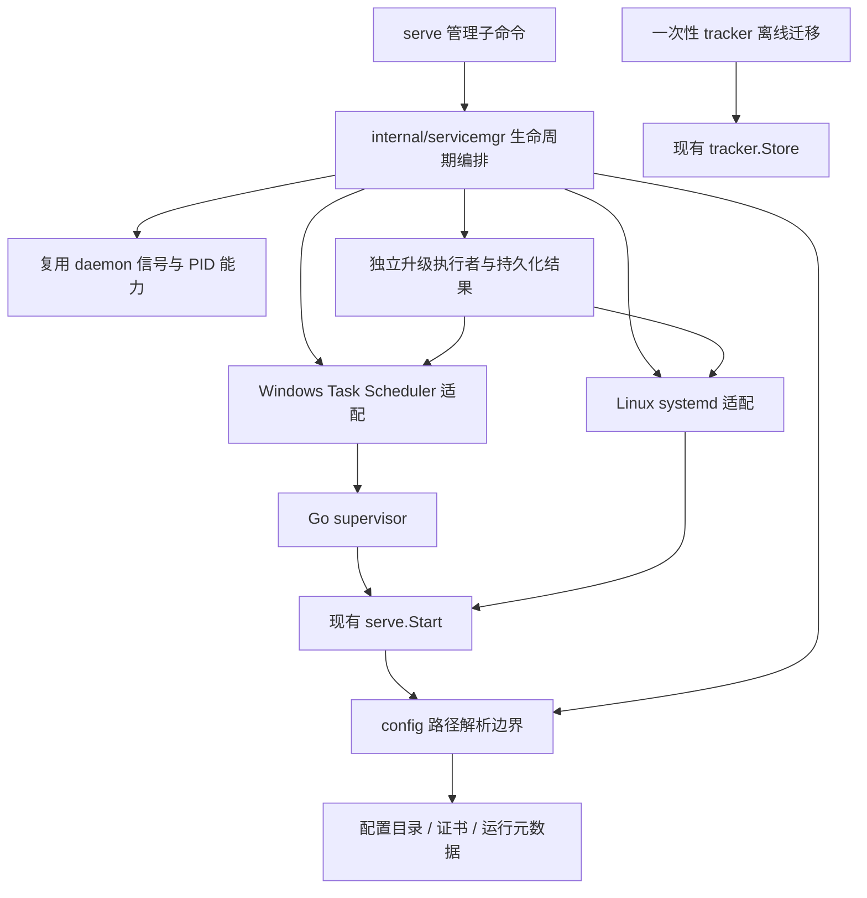

<!-- template_id: design; template_version: 1.1.1 -->
# Gofer 原生 server 管理与仓库迁移准备设计

> 状态：Draft 0.2 / 待人工计划批准

## 修订记录

| 版本 | 日期 | 作者 | 摘要 |
|---|---|---|---|
| 0.1 | 2026-10-07 | Codex | 配置目录路径变量、原生 Windows/Linux server 管理、脚本替代及独立 tracker 迁移方案 |
| 0.2 | 2026-10-07 | Codex | 保留由 job 发起的 server 自升级；由独立升级执行者完成切换并持久化结果，补充 worker 升级协同与进程隔离验收 |

## 背景与目标

Gofer 的源码、运行程序和配置资产应能分别管理与迁移。最终用户能够用
`gofer serve` 子命令管理 Windows 登录计划任务或 Linux systemd 服务，证书和数据保留在
配置目录，仓库有自己的 issue/memory tracker。移动源码后只需重登记程序路径，无需修改证书路径。
开发 agent 在完成构建与授权检查后，可通过 job 发起 server 自升级，再使用现有 worker upgrade 更新 worker。
内置管理能力必须保留此既有工作流，不能要求操作者额外打开独立终端。

本设计保持工具中立，不记录其他项目名称、机器部署路径、账号或某次会话的运行状态。
具体部署输入及操作证据由使用方维护，不进入 Gofer 的通用设计、计划或工具默认值。

公开工作声明：`thinking_mode=RIGOROUS`；核心目标为可迁移、无外部管理脚本的 server 管理及独立 tracker；
scope freeze 为以下四项；`expansion_policy=DEFER_OR_REQUEST`。设计预算为一次 discovery、一次自检，
仅在核心阻断存在时追加纠正，最多八轮；形成可评估候选后停止在 Design Gate。
涉及 CLI、服务生命周期和 tracker 数据归属，按 Full 路由；当前只交付设计，不把结构自检当作独立评审。

## 名词

| 名词 | 本设计含义 |
|---|---|
| config-dir | `config.ConfigDir()`：`GOFER_CONFIG_DIR` 优先，否则用户默认配置目录 |
| config-file | `-c/--config` 等现有规则选择的具体配置文件；不等同于 config-dir |
| 注册 | 向操作系统写入持久启动入口；与立即启动分开 |
| 受管实例 | Gofer 登记并可验证所有权的计划任务或 systemd unit，默认名 `gofer-serve` |
| supervisor | Windows 进程看门狗；不指项目的 AI 监督者 `internal/supervisor` |
| tracker | 仓库 `.gofer/tracker` 下的 JSONL 真源；server SQLite 是同步镜像 |

## 范围与非目标

1. 本机服务路径字段支持 `{config_dir}`，现有证书转移至 config-dir/certs。
2. `serve register/uninstall/start/stop/restart/status/logs`，Windows 登录计划任务、Linux systemd。
3. Windows supervisor 内置；日常管理摆脱 `start.ps1`、`win-supervisor.ps1`。
   提供使用预构建程序的受管升级，取代脚本承担的二进制替换、健康确认与回滚。
4. 按明确记录归属导出 Gofer 的 issues/memories，在 Gofer 仓库建立独立 tracker，验收后再搬目录。

非目标：重写 worker 启停、恢复 Windows SCM/nssm 支持、自动登录、保证锁屏时 GUI 可用、通用变量模板引擎、
自动拉取源码或构建前端、自动搬运行数据库、跨用户凭据管理、全体 worker 的自动批量升级与版本发布编排。
本次 tracker 拆分使用一次性离线迁移工具，不增设通用 repo export/import 平台。

所有权为 Gofer 项目，文档放本仓库 `docs/design`。源 tracker 的分拆和具体机器切换是后续操作，
其记录留在原 tracker 与迁移证据中；本设计不修改相邻项目。

## 已确认事实与规范

| 事实 | 当前证据 |
|---|---|
| `serve` 已有 stop/reload，Windows `-d` 和命名事件已实现 | `internal/commands/serve.go`、`stop.go`、`internal/daemon/daemon_windows.go`；实际 CLI help |
| 现有 stop 只调用 pidfile 停子进程，无法关闭外部看门狗 | `runServeStop` → `stopDaemon`；`scripts/start.ps1` 额外设置 stop marker |
| 现有 Windows 受管方式使用登录计划任务，在用户桌面会话运行 | `scripts/start.ps1` 的任务定义；现有 Windows 桌面设计 |
| 现有脚本依赖源码位置、工作目录与 `web/dist` | `scripts/start.ps1`、`win-supervisor.ps1` |
| `tool cert` 默认输出到 config-dir/certs | `internal/commands/tool.go:runToolCert` 及 help；无需新增证书生成器 |
| 配置原文直接解码后默认化、校验，没有本设计的专用路径解析阶段 | `internal/config/loader.go:Load`；配置写接口会消费配置对象，必须保护模板原文 |
| 最近父目录 tracker 会被自动发现，repo init 可建立本仓独立 tracker | `internal/tracker/discovery.go`、`repo.go` |
| issue 包含状态、时间、评论、notes、parent、deps 等 | `internal/tracker/model.go`；按标题复制会丢失数据 |
| 镜像 issue/memory 的身份包含 tracker_id，拆分必须创建新 tracker_id | `internal/jobstore/tracker.go` 的复合冲突键；`internal/tracker/sync_http.go` 的同步请求 |
| repo init 会按项目路径推断 project_key，单独建立目录仍可能归属父项目 | `internal/commands/repo_projectkey.go`；必须显式核对或绑定 gofer 项目 |
| 旧 Windows selfupdate 验证祖父是 ps1 supervisor | `scripts/win-selfupdate.ps1`；切新 supervisor 时不能继续调用旧拓扑守卫 |
| 现有 server 自升级可由 exec job 发起：先替换文件再结束 server，由外部 supervisor 重启 | `scripts/win-selfupdate.ps1`；Windows selfupdate runbook 的 job 调用与带外确认流程 |
| 当前 Windows runner 会用 Job Object 回收普通 job 子进程 | `internal/runner/local/runner.go`、`internal/proctree/proctree_windows.go` 的 KILL_ON_JOB_CLOSE/BREAKAWAY_OK；新升级执行者必须显式脱离 |
| 普通 daemon 分离启动在 breakaway 被拒时会降级重试 | `internal/daemon/daemon_windows.go:StartDetached`；自升级不能接受留在原 Job Object 的降级 |
| worker 已有校验、drain、原地替换、独立启动、注册交接与回滚 | `internal/worker/upgrade_run.go`、`upgrade.go`、`internal/commands/worker.go`；worker upgrade CLI help |

代码图项目 `gofer` generation 为 2026-09-05T06:59:33Z。已执行入口搜索、调用追踪、snippet 和路径 coverage。
旧图行号已漂移，tracker 等新增路径无索引，scripts 被排除；上述实质事实以当前源码及 CLI 核对为准，
不把图结果当作完整影响面审计。

依项目规则 G001/G003/G011/G021/G022/G032/G045，复用配置目录与公共 flag，编排保持在入口层之外，
新 CLI/配置行为在实现时同步 usage Skill。Windows SCM 决策继续遵循既有桌面设计。
文档/授权遵循 SR1103、SR1107、SR1137、SR1408；无规范例外。

## 总体方案

### 1. 配置目录与证书路径

推荐配置：

```yaml
server:
  tls:
    cert_file: "{config_dir}/certs/server.crt"
    key_file: "{config_dir}/certs/server.key"
```

保留生成器的 config-dir/certs 默认行为。迁移已有证书时复制整个证书集合，包括原 CA 与私钥，
校验证书/私钥配对和文件内容，再切路径；不重新生成 CA，已有手机/浏览器信任继续有效。

路径解析契约：

- 只支持精确的 `{config_dir}`。一轮替换，不执行 shell、不递归展开其他模板、不展开任意环境变量。
- config-dir 来自统一 `ConfigDir()`。`-c` 只选择配置文件，不隐式改变 `{config_dir}`；二者均显示在 status 中。
- 受管服务注册时冻结有效 config-dir 的绝对路径，并向子进程显式传递 `GOFER_CONFIG_DIR`。
  已有系统环境变量仍是注册默认来源，任务无需依赖调度器进程是否刷新了环境；变更环境后重新 register 才更新冻结值。
- 第一批仅支持本机服务字段：TLS cert_file/key_file、server.web_dir、log.file/dir、storage.root/db_path。
  CLI `--web-dir`、`tool cert --out-dir` 使用同一个路径解析函数。
- 不在整个 YAML 上做字符串替换；prompt/agent args/项目 host/container 路径、worker roots 不在首批范围。
  后者属于不同执行主机，不能提前按 server 的 config-dir 展开。
- 无变量的路径保持现有语义。空值保持默认；未知花括号变量在支持的路径字段中报具体字段错误。
  `{config_dir}` 必须处于路径根前缀；解析为绝对路径后做平台规范化。
- 解析发生在取用文件/目录的边界或专用 runtime path view。配置对象与保存接口保留模板字符串，
  不对 `Config` 原地改成展开路径。启动、reload、校验和写接口共享同一解析/字段校验规则。
- 校验解析能力不等同于创建路径；启动检查实际证书，失败按现有 TLS 策略报告。
  `register --start` 的预检必须在写入口前拒绝无效配置或缺失的必需 TLS 文件。

不增加另一套 certificates 配置模型。配置目录保持机器级权限，私钥不入 Git、不进入 tracker 导出包。

### 2. 对外 CLI 契约

以下均为提议的新契约，不能当作当前已实现命令：

| 命令 | 行为 |
|---|---|
| `gofer serve` / `serve -d` | 保留前台/临时后台启动；不注册系统入口 |
| `serve register` | 创建或更新当前配置的系统入口，默认只登记；`--start` 才启动 |
| `serve start` | 启动已登记实例；未登记时提示 register，重复启动幂等 |
| `serve stop` | 停止受管实例及看门狗；未登记则复用现有 pidfile stop；重复停止幂等 |
| `serve restart` | 成功停止后再启动；停止失败不得启动第二实例 |
| `serve uninstall` | 停止并移除受管入口；保留 config、certs、数据库、日志、应用程序 |
| `serve status [--json]` | 区分注册、系统入口状态、supervisor/server PID、健康、版本、桌面 session、路径错误 |
| `serve logs [--follow] [--lines N]` | 默认读取已解析的应用日志；Linux可显式选择 journal 诊断 unit 启动；不依赖工作目录 |
| `serve reload` | 保留现有 reload 与结果回执 |
| `serve upgrade --binary <prebuilt> [--no-wait]` | 终端或 job 发起受管二进制升级；交给独立执行者预检、切换、确认或回滚；返回 upgrade_id |
| `serve upgrade status <upgrade_id> [--json]` | 查询持久化升级结果，server 重启及发起 job 中断后仍可查询 |

注册参数：

- `--name` 默认 `gofer-serve`；不同实例必须有独立配置/运行目录和监听端口，不能仅改 name。
- `--exe` 默认当前运行的 CLI 映像绝对路径。允许管理 CLI 在 PATH、server 程序在另一目录。
- `--work-dir` 默认有效 config-dir；显式相对 web-dir 按该目录解析。标准发布默认使用嵌入 Web。
- `-c/--config` 复用公共绑定；记录选定配置文件绝对路径，拒绝不存在的服务配置。
- Linux `--scope system|user`，默认 system；system 要求显式 `--run-as <user>`，注册需要相应权限，
  不把 sudo/root 自动当作执行 job 的用户。user 使用当前账号的 user unit。
- Windows 当前用户 InteractiveToken、AtLogOn、Limited 默认；`--elevated` 显式选择并要求权限。
  不支持以密码保存其他账号。Linux scope 参数在 Windows 拒绝。
- `--start` 可选；`--adopt` 仅用于一次性接管已核对的旧 Gofer ps1 计划任务。
  同名非 Gofer 对象即使使用 --adopt 也拒绝覆盖。

register 幂等：规范一致不重复改写；实例运行中且注册内容变化，要求先 stop。
uninstall 仅处理具名且所有权匹配的入口；停止失败保留登记。注册失败恢复原入口，不报告虚假成功。
默认不强杀进程；超时保留诊断与非零退出码。禁止仅凭 PID 杀掉未知进程。
systemd 管理必须通过 systemctl 停止，否则 `Restart=on-failure` 可能再拉起 server。

### 3. 管理元数据与 Windows supervisor

注册保存 config-dir/run 下的服务描述：schema version、backend、name、owner、exe、work-dir、
config-file、有效 config-dir、现有规则推导的 server runtime-dir、非敏感启动选项、登记版本。
这些是可重建的本机元数据，不写回应用配置，也不存 token。
现有 `-c` 对 server pid/log 目录的选择保持兼容；有别于 config-dir 时，管理端必须使用记录的 runtime-dir。

Windows 计划任务直接运行编译后的 Gofer supervisor，不引用源码脚本或 pwsh：

```text
登录计划任务
  → config-dir/run/service/gofer-supervisor.exe serve supervise --spec <绝对描述路径>
    → 已登记的 server.exe serve -c <config-file> [明确的非敏感选项]
```

supervisor 是注册时复制的 Gofer 同构建程序，用独立文件避开 Windows 父/子共用映像的升级占用。
这是实现细节，不要求用户安装第二工具。更新 supervisor 在停止实例后进行，校验 spec schema/构建兼容性，
不向新程序隐式传递未知格式。管理启动、升级、重登记使用同一实例互斥锁。
升级执行者再使用独立的 Gofer 程序副本，不依赖待更新的 server 或 supervisor 映像存活。
普通停止关闭 supervisor；升级执行者即使关闭整条旧受管链，也必须能重新拉起新链并回滚。

Go supervisor 保留当前必要行为：隐藏窗口、子进程崩溃重启、有限退避、停止标记、PID/会话日志。
supervisor 自身故障由计划任务的有限重启设置兜底；连续快速失败超预算进入 failed 状态，避免无限重启。
快速失败回滚只针对升级事务保存且身份已核对的上一个程序，不因发现任意 `*.old.exe` 就降级。

stop 先在共享实例控制状态中设置停止意图，再优雅停子进程，等待两者退出；重启清除此意图。
Task Scheduler 强行停止只作为显式后续操作，不作为正常 stop 路径。
计划任务仍要求用户登录；GUI 可用性受用户会话、锁屏和权限等级影响，status 如实展示。

### 4. Linux systemd

原生生成 unit，`ExecStart=<绝对exe> serve -c <绝对config-file>`，不使用 `-d`、不增加 Go supervisor。
设置 WorkingDirectory、执行用户、非敏感 `GOFER_CONFIG_DIR`、Restart=on-failure、有界 RestartSec/StartLimit、
符合现有 shutdown 时长的 TimeoutStopSec。服务启动后自行读取配置目录 `.env`。

system scope 使用系统 unit 与显式执行用户；user scope 使用 user unit，按当前账号登录/用户管理器生命周期运行。
不自动启用 linger、不提权。register 负责写入并 daemon-reload/enable，--start 才 start；
uninstall 先 stop、disable，再仅移除匹配的 unit、daemon-reload。所有路径使用各平台合法的参数/XML/unit 转义。

### 5. ps1 收敛与升级边界

`start.ps1` 的 up/stop/restart/remove/status/logs 分别映射到 CLI；upgrade 改为接收预构建二进制。
构建仍由 `go build`/make/CI 承担，管理 CLI 不隐式 git pull、不自动改变源码分支。
新受管方式通过 Windows/Linux 实机验收并切换后，删除日常管理的 start/supervisor/selfupdate 脚本及旧调用。
smoke/selftest 等测试脚本按测试需要保留；“无 ps1 依赖”不等于禁止测试用 PowerShell。

server 自身 exec job 发起升级属于本期必需能力。CLI 完成预检与持久化请求后，把执行权交给独立升级执行者，
确认其独立存活并接管请求后才允许触发停机。job 场景只返回 accepted/upgrade_id，不同步等待自身 server 重启；
终端默认等待最终结果，--no-wait 可改为接管后返回。agent 通过升级结果和新进程身份确认完成，
不把发起 job 的成功、断连或 orphaned 状态当作升级最终结果。

旧 selfupdate 脚本的直接父进程守卫由受管实例身份核对替代：配置/spec、目标程序、实例所有者及当前进程均匹配。
脚本只有在此 job 工作流通过隔离验收后才删除，不能先停用入口再把自升级留给后续设计。
独立执行者使用现有 CLI 构建产物的内部入口，不另发一个工具；其权限来自本地操作系统/已授权执行环境，
不赋予普通 job token 管理其他 worker 的权限。

Windows：显式 breakaway 脱离原 runner Job Object，stdio 指向独立日志；breakaway 被拒即预检失败，
旧 server 保持运行，不能复用普通 daemon 的降级分支来宣称脱离成功。
Linux：setsid 只脱离终端/进程组，不能脱离 systemd cgroup；受管升级执行者由对应 scope 的独立 transient unit
启动，与 server unit 分离。创建权限或独立启动失败时不切换、不隐式提权。

## 架构



拟新增 `internal/servicemgr` 只负责 OS 入口与生命周期，按平台文件拆分，commands 仅绑定/转发。
Windows Task Scheduler 使用内置 API/COM 注册任务 XML，不生成临时 ps1；复用现有 Windows 库与事件能力。
Linux 使用 exec.Command 的参数数组调用 systemctl，不拼 shell。
路径 helper 放 `internal/config`；不把业务 supervisor 包或 workerupgrade 协议复用成服务管理器。

## 关键流程

### 首次注册与启动

解析输入与有效目录 → 预检程序/配置/证书/web路径/账号 → 检查现有入口所有权 → 原子保存描述与必要程序副本
→ 写入 OS 入口 → register 成功；仅 --start 或显式 start 才启动。
启动成功须验证预期 PID、exe、配置和端口归属，再检查健康；已有其他进程的 /health 200 不能代替验收。

### 升级与回滚

验证预构建二进制可执行、平台/架构、版本及 Web 资源 → 将候选暂存到目标同卷
→ 保存升级请求与 upgrade_id → 启动并确认独立升级执行者接管 → 向发起方返回 accepted（job 场景）
→ 独立执行者锁定实例、等待其他在途工作结束 → 保存旧程序与注册元数据 → 停止实例
→ 替换并刷新 supervisor 副本（Windows） → 启动并验证新身份/健康
→ 记录成功。任何替换失败恢复旧文件；新启动失败恢复旧程序及元数据并确认旧实例健康，报告升级失败。
停止失败不替换；回滚失败保留所有证据并明确 failed。日志与结构化结果包含阶段、版本、PID、路径和原因，
不含 token。程序升级不回滚数据库；候选涉及不可逆 schema 变化时拒绝宣称二进制回滚足够，另走迁移 Gate。

运行阶段与终态存到 config-dir/run/upgrade 下，身份包括 upgrade_id、来源 job ID（如有）、目标实例、
程序版本/hash、执行者 PID、起止时间及错误；原子写且从新 CLI/server 可查询。
启动执行者失败不进入停机阶段；接管与旧 server 停机之间的崩溃能按持久状态识别，不能把残留 running 自动判为成功。
drain 有明确超时且排除发起自升级的当前 job，避免等待自身；其他任务未结束则超时放弃，保留旧实例。
若需更新磁盘 Web 资源，先暂存并纳入回滚；默认嵌入 Web 已随候选程序交付。

### 开发后协同升级 server 与 worker

构建并验证各目标平台候选 → job 发起 serve upgrade → 独立执行者完成切换
→ agent 重连查询升级终态、运行版本、健康与能力 → 使用现有 `worker upgrade <id>` 逐个升级需要更新的 worker。
协议门槛决定升级次序；不在 server 正重启时把 worker 的控制通道一起断掉。

worker upgrade 已支持 --file 指定跨平台候选，缺省使用 server 自身二进制且仅限相同 os/arch；
默认等待在途 job（drain），新 worker 完成注册/ready 交接后旧 worker 才退出，失败恢复旧程序。
升级请求仍要求现有 can_admin 用户身份；普通 job token/worker token 不自动晋级。
不要在目标 worker 自己的在途 job 内同步发起其默认 drain 升级，避免当前 job 等自己退出。
协同流程复用 worker upgrade 的结果/历史，不新增另一个 worker 升级协议，也不把所有 worker 升级并入 server 事务。

### tracker 拆分

先在 Gofer 仓库创建 `.gofer/tracker`，随仓库整体迁移，路径始终相对于 Gofer 仓库根。
不共享父目录 tracker，不把机器级 config-dir/gofer.db 当作仓库 tracker。

1. 导出前同步源 tracker 并暂停相关记录写入，生成 source 文件 hashes 和选择清单。
   新 issue/修改发生后清单失效，切换前重新导出并比对；不能只凭 server 停机假设 tracker 无并发写。
2. issues 从 `gofer` tag、明确标题/已知记录归属形成候选，包含所有状态；旧条目不一定有 tag。
   通过显式 allowlist 固定选择，按 parent、children、deps、反向引用检查闭包。
   与其他工具共享的上级/依赖记录不自动整组搬入：报告边界引用，由清单明确保留引用上下文或阻断切换。
3. memories 没有统一 Gofer 标签。按 key/tag/content 产生候选，再冻结完整 key allowlist；
   legacy dab/dev-agent-bridge 条目也检查归属。只搜索关键词不能作为完整导出依据。
4. 离线包包含完整 issue/memory 对象、源 tracker_id、选择清单、边界引用、文件 hashes/计数。
   保留原 ID、状态、创建/修改时间、assignee/owner、comments/notes、parent/deps；不输出正文到终端。
5. 用现有 Store/锁/原子写能力导入临时目标目录，整体校验后发布正式 tracker。
   创建新的 tracker_id；新建 issue 前缀用 `gofer`，既有历史 ID 不改名。
   不复制源 `.local` 同步游标/锁/缓存。默认 auto_sync=false，验收通过才开启。
6. 登记独立 Gofer project（host/container 路径按实际视图核对），tracker project_key 显式设为 gofer，
   repo prime/status 与 hook 在主机/容器均确认最近 tracker 是本仓。存在父工作区规范仍正常继承。
7. 同 ID/key 同内容导入幂等；不同内容停止并报告差异。首次同步验证独立镜像、计数、完整关系，
   检查父工作区 tracker 与源 tracker 的非迁移内容未受影响。
8. 验收前源数据保留。切换后旧源 Gofer 记录作为迁移快照保留，源侧持续可修改的其他工具记录继续正常工作；
   对选择清单中的旧记录使用离线归属清单标明迁入目标，Gofer 的操作入口与自动化只使用目标 tracker。
   现有数据模型没有迁出记录的写保护；归属清单是迁移证据，不宣称它能自动阻止手工写旧 tracker。
   切换时必须核对并停止仍面向旧 Gofer 记录的自动化，不能用 close 冒充业务完成。
   源清理需单独确认并处理同步镜像，不用直接删 JSONL 达成“迁移”，避免同步拉回或 memory tombstone。

本期一次性工具仅处理具名两个 tracker 与离线包，复用 Store，不建设跨库在线迁移服务。
迁移工具须自检源记录守恒、target 字段相等、引用边界及幂等性，再进入具体切换。

### 实际搬迁顺序（供后续操作计划细化）

增强在原位置完成隔离验收 → 原证书复制到 config-dir 并切换模板路径 → 独立 tracker 导入与验收
→ 新 CLI 接管旧计划任务 → 用新 stop 结束 server 与 supervisor → 备份并搬整个仓库
→ 从新程序路径重新 register/start → 修复 usage Skill Junction、容器挂载/项目路径/索引与需保留的 Git worktree
→ 验证 HTTP、HTTPS、Web、历史数据、简单 job 与 tracker。worker 由用户按需启动。

server 使用嵌入 Web 时不依赖源码工作目录；需要磁盘 Web 的开发场景显式重登记 work-dir/web-dir。
机器配置目录、数据库和系统 `GOFER_CONFIG_DIR` 保持原位。迁移不会自动修复旧会话/历史 job 的 cwd，
不能承诺交互会话无缝继续，须单独核对。

## 安全、数据、运维与回滚

- Windows 保留用户桌面会话，不把任务换成 session 0 服务；权限等级显式选择。
- Linux unit 所有权、执行用户与凭据文件权限预检；禁止凭据嵌入 XML/unit/启动参数/日志。
- 注册/卸载只触碰已核对的具名对象；程序路径/工作目录含空格、Unicode 均按平台转义并实测。
- uninstall 保留证书、数据库和用户程序；配置数据回滚与程序回滚分开，tracker 源快照不自动删除。
- 后续实机验证先用独立 name/config-dir/端口，不替换当前运行实例；正式切换另行取得具名授权。
- G045 同步范围：serve 管理、Windows/Linux 部署、路径模板、证书迁移、tracker 独立归属、旧脚本入口。
  当前仅设计，不把提议命令写入 usage Skill 的已实现用法。

验收矩阵：

| 场景 | 必须观察到的结果 |
|---|---|
| 路径模板 | 环境覆盖/默认目录、斜杠与空格、-c 不改变 config-dir；保存/reload 后原文仍是模板；非路径 prompt 不变 |
| 证书转移 | 原 CA/证书/私钥内容保持，TLS 可用，已有信任可继续访问；源码移动不影响证书加载 |
| Windows 注册 | 干净测试机无仓库 ps1/pwsh 依赖，InteractiveToken 登录启动、窗口隐藏、会话/PID/路径正确 |
| stop/restart | 子进程和 supervisor 都退出且不会复活；停止超时非零；重启无重复实例 |
| Windows 崩溃/升级 | 子进程/看门狗故障有限重启；候选失败恢复旧版本；job 自升级验收后才移除旧 ps1 入口 |
| job 发起自升级 | exec job 返回 upgrade_id；旧 server/Job Object 结束后升级执行者仍存活；结果跨重启可查 |
| 执行者隔离失败 | Windows breakaway 被拒/Linux 独立 unit 创建失败时拒绝切换，旧 server 仍运行 |
| 升级回执/恢复 | 发起 job orphaned 不等于失败；按持久终态和实际运行版本判断；执行者中断不报告成功 |
| worker 协同 | server 确认就绪后原 worker upgrade 可继续使用，校验、drain、注册交接、失败回滚与权限均保持 |
| Linux 两种 scope | unit 可登记、启停、enable/uninstall、journal 可读；执行用户和环境正确，重启策略不抵消 stop |
| 幂等与所有权 | 重复操作可预期；拒绝覆盖同名其他任务/unit；失败不丢原注册 |
| 卸载 | 入口消失且进程停止，数据库/证书/日志/用户程序仍在 |
| tracker 拆分 | 全状态/评论/notes/时间/关系与选定源相等，新 tracker_id，旧 ID 保留，闭包无未处理引用 |
| tracker 同步 | 最近 tracker 与 project_key 均为 gofer，无父 tracker 污染；Gofer hook/自动化均使用新入口，旧源快照归属清楚 |
| 目录搬迁 | 新入口只指新程序，Web/TLS/历史数据/简单 job 与 Skill 链接正确 |

## 决策

| 编号 | 推荐决策 | 理由 |
|---|---|---|
| D1 | 首批仅 `{config_dir}` 和本机服务路径字段 | 满足迁移需求，避免误替换 agent 模板和远端路径 |
| D2 | 证书保留原 CA，复制到配置目录 | 换路径无需重新安装信任 |
| D3 | Windows 登录任务 + Go supervisor，Linux systemd | 保持 GUI 能力并用各平台既有进程管理 |
| D4 | register 与 start 分开，卸载保留数据 | 明确生命周期，失败易恢复 |
| D5 | 标准发布用嵌入 Web，注册冻结路径/配置目录 | 消除源码相对路径与调度器环境漂移 |
| D6 | supervisor 独立程序副本；升级接收预构建程序 | Windows 映像占用可控，不将构建/源码更新塞进管理命令 |
| D7 | 保留 job 自升级，交给独立执行者并持久化结果 | 已有工作流不能降级；停机后仍有执行者完成重启/回滚 |
| D8 | tracker 新身份、旧记录 ID 保留、显式 project_key | 与父 workspace 分开且保留历史引用 |
| D9 | 一次性离线选择迁移，源快照验收前保留 | 当前仅一次拆分，不扩大为通用迁移框架 |

## 待确认事项

Design Gate 需确认上述 CLI、Linux system 默认 scope/显式用户、Windows Go supervisor、
job 自升级的独立执行者/结果查询及 tracker 源快照策略。以上是完整推荐候选，不是待实现功能的现状说明。
具体迁移 allowlist、边界依赖归属、Linux 测试主机和实机切换窗口在规划/操作阶段补齐。
没有独立评审批准或实现授权；本轮自检和 validator 仅证明文档结构及候选内部一致性。

## 结论与人工计划 Gate

先增强再迁移可行。核心结果是用统一 CLI 管理 server、配置资产脱离源码路径、tracker 随独立仓库移动。
当前候选停在 Draft 0.2 Design Gate。设计确认后可形成实施计划并完成适用评审；计划批准与明确执行请求
到位后才实施。代码验证通过后，正式服务接管、证书切换、tracker 数据分拆和目录移动按具名操作另行确认。
本轮没有对运行实例执行这些动作。
