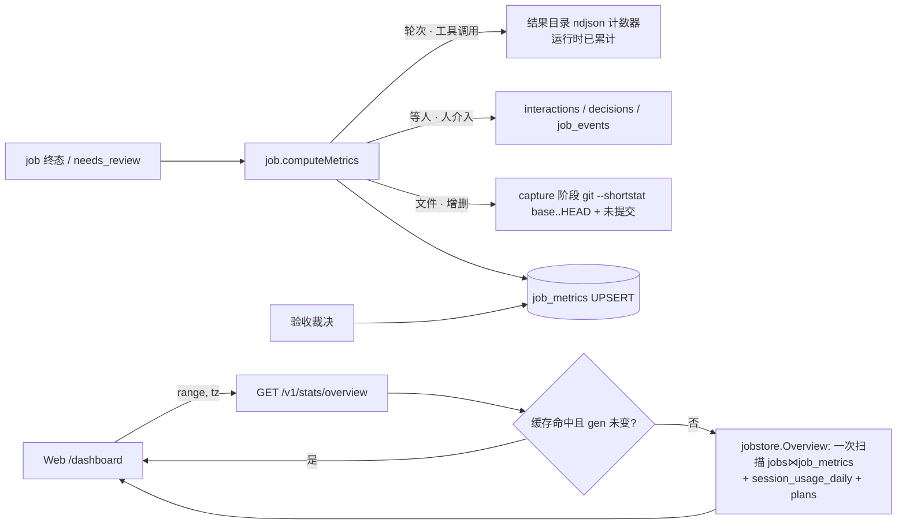

<!-- template_id: design; template_version: 1.1.1 -->
# Dashboard 统计页改版（gofer-yelm）设计

> 状态：Draft 0.1 / 待人工计划批准
> 原型：[`dashboard-preview.html`](dashboard-preview.html)（示例数据，可切范围 / 分桶，悬停看明细）。
> 参考：kandev Statistics（stats-overview / stats-github-workload / plugin-session-cost / plugin-provider-usage）。

## 修订记录

| 版本 | 日期 | 作者 | 摘要 |
|---|---|---|---|
| 0.1 | 2026-10-09 | inhere / Claude | 初稿：页面结构、指标口径、数据来源盘点、`/v1/stats/overview`、分期 |

> 仅语义变化递增版本；纯 identity/provenance/元数据纠正沿用原版本，并在 Git/进度记录中留痕。

**规划声明**：thinking_mode=RIGOROUS；核心目标 = 让 Dashboard 一眼回答「一段时间里系统和 agent 干得怎么样」；
scope freeze = issue gofer-yelm 列出的七组内容，外加现有 Dashboard 卡片的去向；只出设计和静态原型，不实施；
review budget = 1 轮合并评审（低暴露度，SR1409）；停止条件 = 用户对 §待确认事项 拍板。

## 背景与目标

现在的 Dashboard（`web/src/views/Dashboard.vue`）是一面**实时计数墙**：job 状态芯片、会话状态、runner / driver、DB 表行数，
还有 24h/7d 两个窗口的 token 用量。它只回答「现在是什么状态」，答不了「这周比上周干了多少、谁干得好、钱花在哪」。
「现在要我做什么」已经由 N3「今天」页接手（默认落地页）。所以 Dashboard 改成**统计墙**，从导航进入。

用户目标：选一个时间范围（近 7 天 / 近 30 天 / 全部），一屏看到：

1. 产出多少、成功率多少、花了多长时间、写了多少代码；
2. 节奏：每天 / 周 / 月的完成量，哪天最高产，最近几周是否持续有产出；
3. 谁在干活：agent / 模型 / 项目排行；
4. 质量与人力：验收通过率、退回率、等验收多久、人介入多少；
5. 极端值：最长和最快的 job；
6. 钱：费用、token 构成、按模型拆分。

设计原则沿用 N3（[`2026-10-09-n3-today-decision-home-design.md`](2026-10-09-n3-today-decision-home-design.md)「设计原则」）：

- **专注**：只回答「这段时间怎么样」。实时状态、待办与操作不放这里，归「今天」。
- **重点先行**：每张卡一个大数字，副指标不超过 3 个。第一屏就是四张主卡和完成趋势。
- **简明**：明细默认不显示。悬停柱子或格子看数，「全部项目」「系统」默认收起，job 名点了跳详情。
- **手机可用**：380px 宽单列、无横向滚动；主卡单列，小指标块两列。

## 名词

| 名词 | 含义 |
|---|---|
| 范围 | `7d` / `30d` / `all`。`7d` = 今天 0 点往前 6 天 + 今天（浏览器时区）；`all` = 第一条 job 起 |
| 结束 job | 范围内 `ended_at` 落入的 job，状态是终态或 `needs_review`。**本页的周期指标都按结束时间归入区间** |
| 运行时长（wall） | `ended_at − started_at`。`started_at` 在 job 开跑时被覆盖（`internal/job/execute.go:217`），所以**不含排队** |
| 等人时长 | job 运行期间等人的时间：交互（工具审批 / 提问）的 `answered_at − created_at` 之和；持续会话 job 还要加上两轮之间等人发话的空档 |
| 活跃时长（active） | 运行时长 − 等人时长 |
| 跨度（span） | 同运行时长，在 workload 列表里与活跃时长并排显示 |
| 轮次 | agent 的回合数（ACP / 会话 job 数 `job.turn_ended`；一次性 CLI job 从输出事件计数，§数据来源） |
| 人介入 | 人回答的交互、人回答的 decision、人给会话 job 发的消息，三者计数之和（管家 / 策略自动应答不算） |
| 验收 | `require_review` 的 job 进入 `needs_review`，人裁决后变成 `done`（通过）或 `rejected`（退回） |

## 范围与非目标

**范围**：重做 `/dashboard` 页面；新增聚合接口 `GET /v1/stats/overview`；新增 `job_metrics` 旁表（P2）以及写入与回填；
现有 Dashboard 的系统卡片收进页面底部的「系统」折叠区。

**非目标（刻意不做）**：

- 实时状态与操作：running / queued、待决策、泳道都在「今天」页。本页只在「系统」折叠区留一行快照。
- PR / CI 指标（kandev 的 GitHub 区）：gofer 没有 PR 数据。
- 消息总数（kandev 的「messages」）：在 gofer 的事件模型里没有稳定口径，用「工具调用」和「人介入」代替。
- 验收弹窗里逐个文件勾「已看」：用户 2026-10-09 已否决。
- 与上一周期的对比箭头、项目筛选：见 §待确认事项，默认不做。
- 自定义日期区间、导出 CSV：不做。「复制统计」只复制一段纯文本摘要。

**受影响项目**：仅 gofer（`internal/jobstore`、`internal/job`、`internal/httpapi`、`web/`、`skills/gofer-usage/`）。

## 已确认事实与规范

数据盘点（2026-10-09，branch `z-dash` @ 87f410ae，只读代码）：

| 数据 | 现状 | 位置 |
|---|---|---|
| `/v1/stats` | 无参数、无缓存；DB 与用量各有 200ms 预算，超时返回 `partial`；WS 主题 `stats` 合并约 2s 推一次；用量只有 24h / 7d 两个窗口 | `internal/httpapi/stats_handler.go:181` |
| jobs 身份 | `project_key`、`agent`、`runner`、`worker_id`、`session_id`、`plan_id`、`todo_id`、`interactive` | `internal/jobstore/store.go:74` |
| jobs 时间 | `started_at`（开跑时覆盖）、`ended_at`（agent 结束时写，`needs_review` 也写）、`reviewed_at`；**没有** created_at 列，排队时长只能从 `job_events` 推出 | `execute.go:685`、`review.go:106` |
| 索引 | `started_at`、`(project_key,status)`、`(agent,started_at)`；**`ended_at` 上没有索引** | `store.go:146-151` |
| 模型 | **没有列**，只在 `request_json.model` 里（多数 job 为空 = agent 默认模型） | `job/model.go:528` |
| job 用量 | `usage_json`：input / output / cache_read / cache_write / total tokens、`cost_usd`、`turns`（只有带预算的 job 才有值） | `runner/usage.go:18` |
| 验收 | 没有 verdict 列。通过 = `done` 且 `reviewed_at` 非空，退回 = `rejected`；请求验收的时刻 = `ended_at` | `job/review.go` |
| Git | `commits_json`（`[{sha,subject}]`，不带行数）、`commits_ahead`；`diff_summary` 是**未提交**改动的 `--stat` 文本；完整 patch 在结果目录的 `changes.diff` | `job/gitdiff.go`、`store.go:94,113` |
| 轮次 | `job_events` 里的 `job.turn_started` / `job.turn_ended`，**只有会话 / ACP job 才有** | `job/session_state.go:71,89` |
| 工具调用、消息数 | 不入库，只在结果目录的 ndjson 日志（`stdout.log`、`artifacts/acp.jsonl`）里 | `runner/acp/runner.go:51` |
| 交互 | `interactions(created_at, answered_at, answered_by, needs_human, status)`，可以算等人时长和人介入 | `store.go:152` |
| 终端会话用量 | `session_usage_daily(day UTC, session_id, model, project_key, agent, 4 类 token, cost_usd)`，按模型拆分 | `store.go:473`、`jobstore/session_usage.go:34` |
| 会话 | `agent_sessions(started_at, ended_at, last_seen_at, turn_no, usage_json)` | `store.go:435` |
| plan | `plans.status/updated_at`、`plan_todos.done`；**没有完成时间戳** | `store.go:334,373` |
| 供应商额度 | **完全没有**。`rate_limit` 只指 gofer 自己的提交限流；`hookrelay/usage.go:596-628` 解析 codex rollout 的 `token_count` 时只取 `total_token_usage`，丢掉了同一行里的 `rate_limits` | `config/model.go:1321` |
| 字段口径 | 已有 `today/cards.go:395` 从 `diff_summary` 正则取增删行，只覆盖未提交改动 | — |

遵循的规范：SR1102（简洁）、SR1106（核心优先）、SR1403 / SR1405（最小充分、延后的项不预做）、SR1409（低暴露度，评审封顶一轮）；
项目规则 G021（入口只做转发，聚合放 `jobstore` / 业务包）、G032（additive 迁移，不留兼容层）、G033（回填命令放 `gofer tool`）、
G045（接口落地时同步 gofer-usage skill）、G031（文档与示例不含业务信息）。

## 总体方案

一个页面，一个聚合接口，一张旁表：

1. **页面**：七段，自上而下（§架构）。范围切换会重新请求；分桶切换（日 / 周 / 月）**纯前端**，用接口返回的日序列重新分桶，不再请求。
2. **接口**：`GET /v1/stats/overview?range=7d|30d|all&tz=<分钟偏移>`，一次返回整页数据。不按区块拆接口，因为页面一次就要全部数据；拆开只会多几次往返和重复的范围过滤。
3. **旁表 `job_metrics`（P2）**：job 结束（以及验收裁决）时，把一个 job 的派生指标算好落库：模型、轮次、工具调用、人介入、等人 / 活跃时长、文件数与增删行。聚合查询只扫 `jobs ⋈ job_metrics`，不在请求路径上解析 JSON 或日志。
4. **系统卡片**：版本、运行时长、runner、DB、Schedules、当前 running / queued 收进底部「系统」折叠区，继续用现有的 `/v1/stats`。

## 架构

### 页面结构（原型即准）

| # | 区块 | 内容 | 默认展开 |
|---|---|---|---|
| 0 | 标题行 | 「统计」+ 一句总计：`近 30 天 · 558 jobs · 62 会话 · 运行 235h 51m`；右侧是范围分段按钮（近 7 天 / 近 30 天 / 全部）和「复制统计」 | 是 |
| 1 | 四张主卡 | **Jobs**、**耗时**、**Git 活动**、**信号**（口径见下表） | 是 |
| 2 | 产出 | 完成 job 柱状图（完成为绿，失败叠在上方为红；分桶 日 / 周 / 月）＋「最高产」面板；活跃度热力图；Agent 横条 | 是 |
| 3 | 项目 | 三列 Top 3：job 数 / 运行时长 / 提交数；「全部项目（N）」收起 | Top 3 展开 |
| 4 | 验收与计划 | 四个小块：验收通过率、退回率、平均等待验收、Plan 完成 | 是 |
| 5 | 耗时分布 | 最长 3 个、最快 3 个（按活跃时长；标题点了跳 job 详情） | 是 |
| 6 | 用量 | 费用大数字、每轮 / 每 job 均价、job 与终端会话的拆分、token 构成；按模型列表（费用 + 入 / 出 / 缓存）；供应商额度（P3，待定） | 是 |
| 7 | 系统 | 一行摘要（版本 · 运行时长 · runner · DB），展开后是原 Dashboard 的系统卡片 | 收起 |

分桶可用性：`7d` 只能按日；`30d` 可按日 / 周（默认日）；`all` 三种都可以（默认周）。首尾不满的桶照常画，悬停提示里注明「不完整」。

热力图：每列一周、每行一个星期几（周一在上），`7d` / `30d` 显示近 6 周，`all` 显示近 26 周。用单一的 `--done` 色分 4 档，档位按全部有产出日的四分位切，不会被某一天的峰值压扁。

### 指标口径

所有周期指标的集合 J = `ended_at ∈ [from, now)` 的 job；「进行中」是当前快照，不受范围影响。

| 卡 / 区 | 指标 | 精确定义 |
|---|---|---|
| Jobs | 大数字 | \|J\| + 进行中 |
| | 完成 / 失败 / 进行中 | `status=done` / `status∈{failed,timeout}` / `status∈{running,queued,waiting_dir,pending_interaction,recovering,awaiting_input}` |
| | 成功率 | done ÷ (done + failed + timeout + rejected)；`cancelled` 不计入，`needs_review` 没裁决前不计入 |
| 耗时 | 大数字 | Σ 运行时长（J，排除 `ended_at` 为空的） |
| | 平均 / 中位 | 运行时长的平均数 / 中位数（中位数在 Go 侧排序求得） |
| | 活跃 / 等人 | Σ 活跃时长 / Σ 等人时长（P2 来自 `job_metrics`；P1 只用交互等待近似，会话 job 的空档不计） |
| Git 活动 | 大数字 | Σ 提交数：`json_array_length(commits_json)`（P2 起读 `job_metrics.commits`） |
| | 文件 / +增 / −删 | Σ `files_changed` / `insertions` / `deletions`：job 的 `base..head` 加上结束时未提交的改动（P2） |
| 信号 | 大数字 | Σ 轮次（排除 exec agent） |
| | 每 job 轮次 | Σ 轮次 ÷ 非 exec 的结束 job 数 |
| | 工具调用 / 每 job 工具 | Σ tool_calls，以及除以同一分母 |
| | 人介入 / 介入率 | Σ 人介入；有过人介入的 job 数 ÷ 非 exec 的结束 job 数 |
| 产出 | 柱 | 按 `ended_at` 的本地日期，统计 done / failed+timeout 数 |
| | 最高产 | 最佳星期（日均完成最高的星期几）、最佳单日、连续有产出天数（截至今天）；`all` 时多一项最佳月份，其他范围换成日均完成 |
| Agent | 横条 | 按 J 中的 job 数排序；右侧文字：数量 · 成功率 · 平均运行时长 |
| 项目 | Top 3 × 3 | 按 `project_key` 分组：job 数、Σ 运行时长、Σ 提交数，各取前 3 |
| 验收 | 通过率 / 退回率 | 范围内 `reviewed_at` 的 job 中，done 的占比 / rejected 的占比；退回中「附意见重跑」= 有 `source_job_id` 指向它的后续 job |
| | 平均等待验收 | `reviewed_at − ended_at` 的平均值与中位数；附带当前待验收的数量（快照） |
| | Plan 完成 | 范围内 `updated_at` 落入且 `status=done` 的 plan 数（没有完成时间戳，取近似）；附带 todo 完成数 |
| 耗时分布 | 最长 / 最快 | 按活跃时长取前 3 / 后 3；「最快」只看 done、排除 exec agent；每行显示 agent · 项目 · 轮次，以及跨度 |
| 用量 | 费用 | Σ job `cost_usd` + Σ `session_usage_daily.cost_usd`（范围内） |
| | 每轮 / 每 job | 费用 ÷ Σ 轮次；job 费用 ÷ \|J\| |
| | token | 入 / 出 / 缓存读，job 与会话两边相加 |
| | 按模型 | job 侧按 `job_metrics.model`（P1 用 `request_json.model`，空则记为「<agent> 默认」），会话侧按 `session_usage_daily.model`；合并后按费用降序，用小标签标出来源 job / 会话 / job+会话 |

`session_usage_daily.day` 是 UTC 日期，与浏览器时区的范围边界最多差一天，作为已知误差写进接口的 `notes`。

### 接口 `GET /v1/stats/overview`

参数：`range=7d|30d|all`（默认 `30d`），`tz`（浏览器 UTC 偏移，单位分钟，缺省用 server 时区）。只读，鉴权与 `/v1/stats` 相同。

```jsonc
{
  "range": {"key": "30d", "from": 1757347200, "to": 1760000000, "tz": 480, "first_job_at": 1742774400},
  "totals": {"jobs": 558, "sessions": 62, "wall_sec": 848460},
  "jobs":   {"total": 558, "done": 501, "failed": 39, "cancelled": 15, "rejected": 3, "in_progress": 3, "success_rate": 0.91},
  "time":   {"wall_sec": 848460, "avg_sec": 1520, "median_sec": 720, "active_sec": 662280, "human_wait_sec": 161340},
  "git":    {"commits": 321, "files": 1217, "insertions": 40887, "deletions": 15121, "jobs_with_commits": 188},
  "signal": {"turns": 1700, "tool_calls": 16012, "human": 126, "jobs_with_human": 98, "denominator_jobs": 501, "coverage": 0.97},
  "daily":  [{"day": "2026-09-10", "done": 14, "failed": 1, "commits": 9, "wall_sec": 30120}],
  "best":   {"weekday": {"dow": 2, "avg": 27.3}, "day": {"day": "2026-09-15", "done": 49}, "month": {"month": "2026-09", "done": 456}, "streak_days": 61},
  "heatmap": {"weeks": 6, "levels": [3, 7, 12]},
  "agents":   [{"agent": "codex", "jobs": 312, "success_rate": 0.94, "avg_sec": 1260}],
  "projects": [{"project": "gofer", "jobs": 229, "wall_sec": 381000, "commits": 122}],
  "review": {"reviewed": 170, "accepted": 141, "rejected": 29, "rerun": 20, "wait_avg_sec": 7860, "wait_median_sec": 3540, "pending_now": 1,
             "plans_done": 11, "todos_done": 70},
  "workload": {"longest": [JobBrief], "quickest": [JobBrief]},
  "usage": {"cost_usd": 314.58, "job_cost_usd": 240.13, "session_cost_usd": 74.44,
            "input_tokens": 16000000, "output_tokens": 1900000, "cache_read_tokens": 598000000,
            "per_turn_usd": 0.185, "per_job_usd": 0.43,
            "by_model": [{"model": "gpt-5.1-codex", "source": "job", "cost_usd": 182.45, "input_tokens": 9500000, "output_tokens": 1100000, "cache_read_tokens": 347000000}]},
  "quota": null,
  "notes": ["session_usage 按 UTC 日切分"],
  "generated_at": 1760000000, "cached": true
}
```

`JobBrief = {id, title, agent, project, turns, active_sec, wall_sec, status}`，`title` 取 job 标题或 prompt 首行（≤60 字）。

- `daily` 始终按日给出（`all` 约 200–700 行），周 / 月分桶、热力图都在前端算；`heatmap.levels` 是服务端给的四分位阈值，前后端口径一致。
- 指标没有数据时返回 `null`（如 P1 的 `signal`），前端显示「—」并提示「自 vX 起统计」，不显示 0。
- `signal.coverage` = 有 `job_metrics` 的 job 占比；低于 0.9 时卡片角标提示「部分 job 无数据」。

### 新表 `job_metrics`（P2）

```sql
CREATE TABLE IF NOT EXISTS job_metrics (
  job_id TEXT PRIMARY KEY,
  model TEXT, turns INTEGER, tool_calls INTEGER, human_count INTEGER,
  human_wait_sec INTEGER, active_sec INTEGER,
  commits INTEGER, files_changed INTEGER, insertions INTEGER, deletions INTEGER,
  input_tokens INTEGER, output_tokens INTEGER, cache_read_tokens INTEGER, cost_usd REAL,
  computed_at INTEGER NOT NULL, version INTEGER NOT NULL
);
CREATE INDEX IF NOT EXISTS idx_jobs_ended ON jobs(ended_at);
```

不往 `jobs` 表加列，原因有三：派生指标会随口径升级重算（看 `version` 列）；回填可以独立批量跑；`jobs` 行保持精简，列表查询不受影响。
token / cost 冗余一份，好让聚合避开 `json_extract`。

## 关键流程



- **轮次 / 工具调用的计数**：在 runner 的输出压缩环节累计，不在结束后重读日志。ACP：`turn_ended` / `tool_call`；claude 流式输出：`result.num_turns`、`tool_use` 块；codex `--json`：`turn.completed`、`item.*` 中的命令执行 / MCP / 文件改动；exec agent 记为 0。不认识的事件不计数，结果记为 `null`，不猜。
- **Git**：在现有 capture_diff 阶段（已经在跑 git）多跑一次 `git diff --shortstat <base>..HEAD`，范围与 `commits_json` 相同，再加上未提交部分的 `--shortstat`。
- **回填**：`gofer tool stats-backfill [--since]`（G033）。从 `job_events`、`interactions`、`commits_json`、尚存的结果目录日志补算；`changes.diff` 和日志已被清理的 job 对应字段留 `null`，靠 `coverage` 如实反映。
- **缓存**：进程内按 `(range, tz)` 缓存，单飞（single-flight）。job 进入终态、验收裁决、会话用量落库时递增全局 `gen`。命中条件是 `gen` 未变且缓存不到 60 秒，`all` 放宽到 5 分钟；`gen` 变了也至少保留 10 秒，防止高频结束时反复重算。
- **前端刷新**：进入页面、切换范围、标签页回到前台时请求；页面可见期间每 60 秒刷新一次。**不订阅** 2 秒一推的 `stats` 主题，那个只给「系统」折叠区用（展开时才订阅）。

## 安全、数据、运维与回滚

- **数据**：只读聚合加一张旁表（additive 迁移，G032）。表丢了可以用回填重建，不影响任何 job 行为。
- **性能**：按 `idx_jobs_ended` 做范围扫描。按一个人每天几十到上百个 job 估算，`all` 量级是 1–10 万行，SQLite 单次 GROUP BY 预计远低于 200ms。中位数和 Top 3 在 Go 侧对已取出的行处理（只取需要的列）。沿用 `/v1/stats` 的预算模式：超过 500ms 就返回已算完的部分加 `partial`。实测 p95 超过 200ms 时，再引入按日的汇总表（SR1405：没有证据就不预做）。
- **安全**：鉴权与 `/v1/stats` 一致；`title` 截断；不返回 prompt 全文或路径。
- **回滚**：前端可以退回旧版 `Dashboard.vue`（一次提交）；接口和旁表留着也无害。

## 决策

1. **只用一个聚合接口**，不按区块拆；分桶在前端做，接口只给日序列。
2. **周期指标按结束时间归属**，与「完成趋势」口径一致；Jobs 大数字另加当前进行中的数量。
3. **耗时同时给运行时长和活跃时长**：大数字用运行时长（现在就算得出，直观），活跃 / 等人作为副指标；workload 列表按活跃时长排，因为它能反映 agent 自己干了多久。
4. **「信号」卡定义为 轮次 / 工具调用 / 人介入**，exec agent 不进分母；数据要等 P2 的 `job_metrics` 才有，P1 期间整卡显示「—」。
5. **派生指标进旁表 `job_metrics`**，在终态时计算，并提供回填命令；不在请求路径上解析日志或 JSON。
6. **系统卡片降级到底部折叠区**，实时数据不进统计墙。
7. **供应商额度不进 P1 / P2**，见待确认 Q2。

## 分期实施（计划阶段再细化）

| 期 | 内容 | 验收 |
|---|---|---|
| P1 | `idx_jobs_ended` + `jobstore.Overview`（只用现有数据：job 数 / 成功率 / 运行时长 / 交互等待 / 提交数 / 验收 / plan / agent / 项目 / 用量，模型取 `request_json`）+ `/v1/stats/overview` + 缓存；新页面，「信号」卡和 Git 增删显示「—」；系统折叠区；gofer-usage skill 补接口说明 | 380px 无横向滚动；三个范围数值与手工 SQL 一致；`all` 实测耗时有记录 |
| P2 | `job_metrics` 表 + 终态计算 + runner 侧计数器 + capture 阶段 shortstat + `gofer tool stats-backfill`；聚合改读旁表；「信号」卡与 Git 增删上线 | 新 job 的 `coverage` = 1；回填后历史 job 的 coverage 有数；终态写入不拖慢 job 收尾（< 50ms） |
| P3（待定） | 供应商额度：在 hookrelay 解析 codex `token_count.rate_limits`，存最近快照 `provider_quota(provider, window, used_pct, resets_at, observed_at)`；用量区显示 5 小时 / 每周两条进度条与重置倒计时 | 只显示真实观测到的窗口，并标出「更新于」；没有数据时整块不显示 |

## 待确认事项

1. **Q1 信号卡口径**：用 轮次 / 工具调用 / 人介入（介入率）代替 kandev 的「人发言占比」，P2 引入 `job_metrics` 并回填历史。是否认可？（默认：认可）
2. **Q2 供应商额度**：gofer 目前没有任何额度数据。A）这次不做（默认）；B）做 P3，只覆盖带 hook 的 codex 终端会话（codex 的 rollout `token_count` 带 `rate_limits`，需要先实机确认字段）；claude 暂时没有可靠来源。
3. **Q3 与上一周期对比**：主卡大数字旁边要不要显示「较上期 ↑12%」？要的话，接口对比范围的计算量会翻倍。（默认：不做）
4. **Q4 项目筛选**：要不要 `?project=` 只看单个项目？（默认：不做，项目区已有 Top 3 和全部列表）
5. **Q5 exec agent**：计入 Jobs / 成功率 / 运行时长，但不进「信号」分母和「最快」榜。是否认可？（默认：认可）
6. **Q6 系统卡片去向**：收进本页底部折叠区（默认），还是移到 Settings 或单独的「系统状态」页？

## 结论与人工计划 Gate

设计和原型都已就绪。核心取舍：一个聚合接口加前端分桶；周期指标按结束时间归属；派生指标进旁表；额度暂不做。
**需要人工批准**：请对 §待确认事项 Q1–Q6 拍板（或回复「按默认」）。批准只放行编写实施计划（P1 先行），不授权实施。
